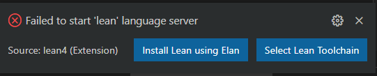
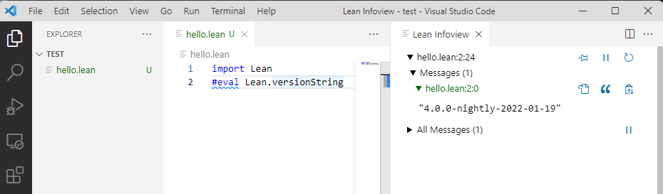

# WindowsにLean 4をインストールする方法 - 簡単な説明

ここでは、VS CodeでLeanを扱えるようにし、そしてLeanをセットアップする方法を簡単に説明します。このインストール手順では、Lakeを使ってLeanプロジェクトを作るために必要な ``git`` がインストールされないことに注意してください。``git`` のインストール方法を知りたい場合や、詳細な説明を読みたい場合は、[このページ](./windows-detailed.md)をご覧ください。

1. まず、[VS Code](https://code.visualstudio.com/)をインストールします。

1. VS Codeを起動し、``lean4`` 拡張機能をインストールします。

    

1. 画面上部にある ``File`` メニューを開き、``New text file`` を選びます(ショートカット: ``Ctrl+N``)。``Untitled-1`` とラベルされた新しいウィンドウが開きます。新しいウィンドウには ``Select a language`` と表示されます。この表示をクリックし、``lean4`` を選びます。画面右下に次のようなポップアップが表示されます。

    

   「Install Lean using Elan」ボタンをクリックします。``VS Code`` 内でターミナルウィンドウが立ち上がり、インストールが始まります。ウィンドウ内には次のような出力を含むテキストが表示されるはずです。

    ```
    info: syncing channel updates for 'nightly'
    info: latest update on nightly, lean version nightly-2023-06-27
    info: downloading component 'lean'
    ```

   もし ``Failed to start 'lean' language server`` と書かれたポップアップが表示されなかった場合、``elan`` が既にインストールされている可能性があります。その場合、コマンド ``elan default leanprover/lean4:nightly`` を実行し、デフォルトツールチェインがLean 4であることを確定させ、それから再びVS Code内でテキストファイルを開いてください。この操作を行わなかった場合、次のステップで失敗する可能性があります。

1. インストールが終わったら、Lean言語サーバーが自動的に立ち上がり、シンタックスハイライトが有効になり、「Lean Infoview」ウィンドウが右側に表示されます。以上を確認したら、次のコードをLeanファイルにペーストします。

    ```lean
    #eval Lean.versionString
    ```

   このコードの末尾にカーソルを合わせると、「Lean Infoview」ウィンドウにインストールされたLeanのバージョンが表示されます。

    

この表示が確認できたら、セットアップ成功です！

## 参考資料
- [Setting Up Lean - Lean Manual](https://leanprover.github.io/lean4/doc/quickstart.html) : 翻訳元、公式。
- [定理証明支援系Lean 4導入手順【VOICEROID解説】 - YouTube](https://www.youtube.com/watch?v=jB1eB6PjrUY) : ぐにらちさんによる、上記インストール手順の解説動画です。
